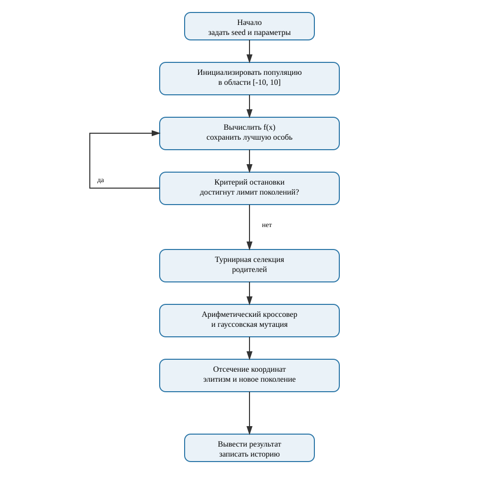
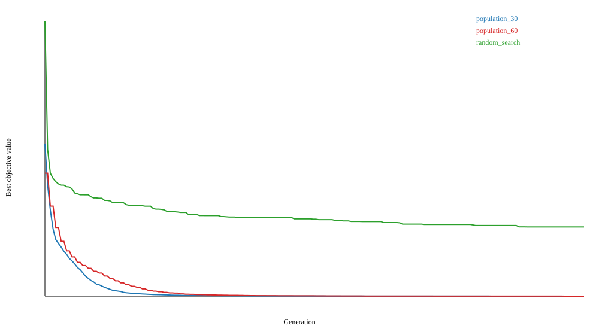
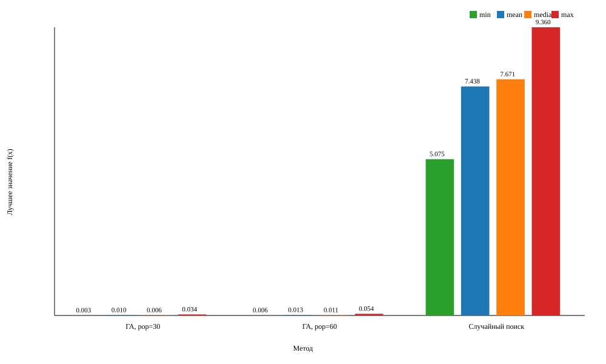

# Лабораторная работа №1

## 1. Постановка задачи и вариант

Требуется найти приближённое глобально оптимальное решение задачи
непрерывной оптимизации `min f(x), x ∈ D`.

Исследуется минимизация многомерной функции Альпина №1:

`f(x) = sum(|x_i sin(x_i) + 0.1 x_i|)`, `x_i ∈ [-10, 10]`.

Здесь `x = (x_1, ..., x_10)`, а область решений имеет вид `D = [-10, 10]^10`.
Ограничения являются покоординатными: `-10 ≤ x_i ≤ 10` для
`i=1,...,10`.

Номер студента `N=21`, группа `517` (`Q=1`), год `2026` (`Y=26`):

`V = 1 + ((17N + 7Q + Y) mod 20) = 11`.

Размерность: `d = 5 + (V mod 6) = 10`. Теоретический глобальный минимум
равен `f(0,...,0)=0`.

## 2. Представление и алгоритм

Генотип совпадает с фенотипом: особь является вещественным вектором из десяти
координат. Декодирование не требуется. Начальная популяция равномерно
генерируется в допустимом гиперкубе.

Параметры алгоритма:

| Параметр | Значение |
|---|---:|
| Размерность | 10 |
| Размер популяции | 30 или 60 |
| Число поколений | 199 или 99 |
| Бюджет вычислений функции | 6000 на запуск |
| Селекция | турнир размера 3 |
| Вероятность кроссовера | 0.9 |
| Кроссовер | арифметический, `alpha ~ Uniform[0,1]` |
| Вероятность мутации координаты | 0.1 |
| Мутация | `x_i := x_i + N(0, 0.5^2)` |
| Обработка границ | отсечение к `[-10,10]` |
| Элитизм | 1 лучшая особь |
| Остановка | фиксированное число поколений |

Для родителей `p` и `q` арифметический кроссовер строит
`c_1 = alpha*p + (1-alpha)*q` и `c_2 = alpha*q + (1-alpha)*p`.
Затем каждая координата потомка с вероятностью `0.1` получает гауссовское
приращение со стандартным отклонением `0.5`. После каждого оператора
применяется `clip(x_i,-10,10)`. Лучший вектор переносится в следующее
поколение без изменений.

Псевдокод:

```text
P <- uniform_population(seed, bounds); evaluate(P); best <- argmin(P)
repeat generations times:
    next <- [best]
    while size(next) < population_size:
        p, q <- tournament_selection(P, size=3)
        c1, c2 <- arithmetic_crossover(p, q, probability=0.9)
        mutate_each_coordinate(c1, p=0.1, sigma=0.5)
        mutate_each_coordinate(c2, p=0.1, sigma=0.5)
        clip coordinates to [-10, 10]; append children to next
    P <- next; evaluate(P); update best
return best
```

Арифметический кроссовер выбран для непрерывного пространства, турнирная
селекция не требует масштабирования функции, а гауссовская мутация позволяет
уточнять перспективные решения и выходить из локальных областей. Элитизм
сохраняет найденное улучшение, а отсечение гарантирует выполнение ограничений.

Все ключевые операторы написаны в `lab1_ga.py`; библиотека оптимизации не
используется. Seed каждой серии явно записан в `config.json` и CSV.

## 3. Экспериментальный план

Проведены 20 независимых запусков для каждой конфигурации. Бюджет функции
фиксирован и одинаков: 6000 вычислений. Сравниваются:

1. популяция 30, 200 поколений с начальным поколением;
2. популяция 60, 100 поколений с начальным поколением;
3. случайная выборка из 6000 допустимых точек.

Отличается только размер популяции, а число вычислений сохраняется. Полные
параметры приведены в `config.json`, результаты — в `results/results.csv`.

## 4. Результаты

После запуска эксперимента сводные значения печатаются в консоль, а все
наблюдения сохраняются в `results/results.csv`. Средние траектории по сериям
сохраняются в `results/trajectory.csv`, график — в `results/convergence.svg`.
CSV является машиночитаемым первичным результатом и позволяет пересчитать
среднее, медиану, стандартное отклонение, минимум и максимум.

### 4.1. Блок-схема алгоритма



На схеме показаны инициализация, оценивание, проверка остановки, турнирный
отбор, арифметический кроссовер, гауссовская мутация, коррекция границ,
элитизм и сохранение результата.

### 4.2. Динамика сходимости



На графике приведены средние по 20 запускам значения лучшей найденной особи.
Для удобства сравнения все траектории пересчитаны в 200 равномерных точек:
исходная длина составляет 200 точек для `population=30`, 100 точек для
`population=60` и 6000 точек для случайного поиска. Поэтому на одном графике
видны как эволюционная динамика, так и итоговое преимущество методов при
одинаковом бюджете вычислений.

Фактически полученные значения для seed `20260101`--`20260120`:

| Метод | Минимум | Среднее | Медиана | Ст. отклонение | Максимум |
|---|---:|---:|---:|---:|---:|
| ГА, population=30 | 0.002655 | 0.010255 | 0.005506 | 0.009753 | 0.034048 |
| ГА, population=60 | 0.006019 | 0.013062 | 0.010504 | 0.010473 | 0.053881 |
| Случайный поиск | 5.075309 | 7.438199 | 7.670728 | 1.162891 | 9.360314 |

При данном бюджете конфигурация с популяцией 30 показала лучшее среднее и
медиану: дополнительные поколения оказались полезнее, чем увеличение
разнообразия одной популяции. Обе конфигурации ГА существенно превзошли
случайную выборку по близости к нулевому минимуму.



На дополнительном графике отдельно сопоставлены минимум, среднее, медиана и
максимум серии. Это позволяет увидеть не только лучший случай, но и
устойчивость метода между независимыми запусками.

## 5. Анализ

Функция имеет много локальных минимумов из-за синусоидального множителя, а
модуль создаёт негладкие участки. Поэтому случайная выборка редко попадает в
узкую окрестность глобального минимума. Генетический алгоритм использует
рекомбинацию удачных координат, локальное гауссовское уточнение и элитизм,
сохраняя найденное улучшение.

Конфигурации имеют одинаковый бюджет: меньшая популяция даёт больше поколений
и чаще применяет отбор/мутацию, тогда как большая популяция поддерживает больше
разнообразия. Итоговое предпочтение должно делаться по среднему и разбросу
20 запусков, а не по одному удачному seed. Критерий качества — близость к
теоретическому минимуму 0 при воспроизводимом поведении.

Полученный результат следует считать хорошим для поставленной задачи:
лучшее значение в серии равно `0.002655`, а среднее по 20 запускам лучшей
конфигурации равно `0.010255` при теоретическом минимуме `0`. Найденные
решения находятся очень близко к глобальному оптимуму. При этом результат не
выдаётся за гарантированное точное нахождение минимума: максимум серии равен
`0.034048`, поэтому разброс явно учитывается. Среднее значение лучше
случайного поиска примерно в 725 раз (`7.438199 / 0.010255`) при том же
бюджете вычислений.

## 6. Проверка допустимости

Допустимый пример: `(0, 0, ..., 0)`. Другой допустимый пример:
`(10, -10, 1, -1, 0.5, -0.5, 3, -3, 7, -7)`.
Недопустимы, например, векторы с координатой `10.1` или `-10.1`.
Инициализация использует только допустимые значения, а после кроссовера и
мутации применяется `clip`, поэтому все сохраняемые особи допустимы.

## 7. Воспроизводимость

```text
python lab1_ga.py --run-experiments
```

Среда, версия Python и параметры запуска могут быть зафиксированы при защите.
Исходные результаты и график не требуют внешних библиотек.

## 8. Проверка соответствия требованиям отчёта

| Требование | Где выполнено |
|---|---|
| Постановка и индивидуальный вариант | раздел 1 |
| Пространство решений, функция и ограничения | раздел 1 |
| Генотип, фенотип, декодирование | раздел 2 |
| Алгоритм, операторы и параметры | раздел 2 и `config.json` |
| Блок-схема | `results/flowchart.svg`, раздел 4.1 |
| Обоснование операторов | раздел 2 |
| 20 независимых запусков | разделы 3–4, `results/results.csv` |
| Статистический анализ | таблица в разделе 4 |
| Вывод о влиянии параметров | раздел 5 |
| Оценка качества результата | раздел 5 |
